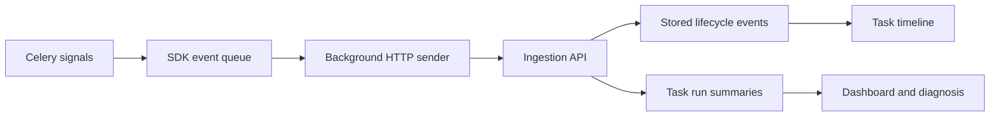

# Investigate a failed Celery job with QueueLoom

**A hands-on tour of QueueLoom for Python developers.**

A task's final exception tells you where it stopped. To investigate what happened before
that, you also need its publication time, worker start, retries and final outcome. This
walkthrough follows those events through QueueLoom's local demo, then explains what the
measurements can—and cannot—tell you.

Allow about ten minutes after installing dependencies. You will run a real Celery worker
with synthetic jobs, inspect a failure and a recovered retry, separate queue wait from
execution time, and read a deterministic incident report. No Docker, Redis service or AI
credentials are required. The alpha is for evaluation; its APIs and storage behavior may change.

This walkthrough uses the current **`main` development branch**, including demo improvements
made after the packaged alpha. The latest published release is separately available as
[v0.1.0a1](https://github.com/Salman85365/queueloom/releases/tag/v0.1.0a1).

## 1. Start the demo

Use **Git and Python 3.11 or newer**. These commands use a macOS/Linux shell:

```bash
git clone --branch main --depth 1 https://github.com/Salman85365/queueloom.git
cd queueloom
python3 -m venv .venv
source .venv/bin/activate
python -m pip install -e ".[server,celery]"
export QUEUELOOM_AI_PROVIDER=template
python demo/run_local.py
```

The `template` setting keeps the report local even if you already have an AI key configured.
On Windows PowerShell, create the environment with `py -3 -m venv .venv`, activate it with
`.venv\Scripts\Activate.ps1`, and replace the `export` line with
`$env:QUEUELOOM_AI_PROVIDER = "template"`. See the [installation guide](INSTALL.md) for more options.

Wait for the terminal to print the dashboard URL, then open
**[http://127.0.0.1:8800/projects/demo](http://127.0.0.1:8800/projects/demo)**. Leave the process
running while you explore. If port 8800 is occupied, start with
`python demo/run_local.py --port 8801` and open the URL it prints instead.

The demo starts a SQLite-backed server, an in-memory Celery broker and a `solo` worker
consuming both `default` and `reports`. It submits randomly selected jobs at a target rate
of three per second. Overview and Tasks refresh every five seconds; event delivery is also
batched, so a completed job may take a moment to appear.

The [demo tasks](../demo/tasks.py) are deliberately simple:

| Task | Behavior | What to inspect |
| --- | --- | --- |
| `demo.tasks.add` | Adds two integers | A short successful run |
| `demo.tasks.send_email` | Sleeps briefly; rejects some synthetic addresses | Occasional `ValueError` failures |
| `demo.tasks.generate_report` | Sleeps for 20 ms per page, with 1–20 pages | Duration and the `reports` queue |
| `demo.tasks.fetch_rates` | Sometimes requests a retry, up to three retries | A task's history across attempts |
| `demo.tasks.sync_inventory` | Always raises `RuntimeError` | A repeatable failure cause |

These functions do not send email or contact inventory or currency services. Their error
messages simulate those failures. Tracebacks in the terminal are expected. Counts, timing
and the order in which tasks appear will vary; let it run longer if a task has not appeared yet.

## 2. Follow one failure back to its code

Open **Tasks**, choose `demo.tasks.sync_inventory` under **Task**, choose `failed` under
**State**, and click **Apply**. Open a task name in the resulting list.

Start with four details:

1. **Task id** identifies this run, rather than every call to the same Python function.
2. **Queue**, **Environment** and **Worker** locate the execution. The demo environment
   defaults to `local-demo` unless you supplied `QUEUELOOM_ENVIRONMENT`.
3. **Exception** contains a `RuntimeError`, its synthetic inventory message and the traceback
   pointing to the deliberate `raise` in `demo/tasks.py`.
4. **Timeline** should contain publication, start and failure events for this ordinary run.

Read the timeline alongside the exception. A job that waited before starting presents a
different investigation from one that started promptly and then failed immediately. Here,
the traceback explains the failure: the demo function deliberately raises it. A production
traceback would be evidence to investigate, not proof of an external service outage by itself.

The demo explicitly enables argument capture, so you can also see its synthetic SKU in
**Args**. Normal SDK instrumentation defaults to `capture_args=False`. That setting avoids
collecting argument representations, but exception messages and tracebacks can still contain
application data.

## 3. Find a retry that eventually succeeded

Return to **Tasks**, select `demo.tasks.fetch_rates`, reset **State** to `all`, and apply.
Look for a row with **Retries** greater than zero. If none is visible, leave the demo running
and check again; retries are chosen randomly.

Open that run and inspect **Retries / attempts** and **Timeline**. A retry reuses the task id,
so QueueLoom groups the events into one task history. Look for a `retried` event, another
publication/start, and a later terminal outcome. Celery may publish the replacement message
before emitting its retry signal; do not expect the timeline to alternate in a perfectly
simple sequence.

Some of these tasks will finish as `succeeded` after retrying. Others can exhaust their retries
and finish as `failed`. A succeeded run can still show the earlier exception in this alpha:
success does not clear the stored retry exception. Use the state and complete timeline to
distinguish a recovered problem from a final failure.

The run's duration and latency summarize an attempt; they are not total elapsed time across
every retry. **Attempts** is derived from observed publication events, so missing events can
also make that count incomplete. The underlying [event folding code](../src/queueloom/server/ingest.py)
shows how these fields are updated.

## 4. Separate waiting from working

On **Tasks**, reset **Task** and **State** to `all`, choose `reports` under **Queue**, and apply.
Open a completed `demo.tasks.generate_report` run.

**Queue latency** is the interval between the recorded publication timestamp and worker
start. **Duration** is the elapsed execution time measured by the worker's SDK timer. The
report function deliberately sleeps for roughly 20–400 ms, depending on its page count;
the displayed duration includes execution overhead as well.

Those two numbers answer different questions:

- A longer duration suggests investigating the function and its dependencies.
- A longer wait with a short duration suggests investigating scheduling, routing and worker
  availability before assuming the function itself became slower.

The distinction helps choose the next check; it does not establish a root cause. In this
demo, one worker consumes both queues and the broker runs in memory. Broker polling,
scheduling and other demo tasks can affect the wait. Separate machines also introduce clock
alignment concerns. A scheduled task's intended delay can appear in publication-to-start
latency, so inspect its ETA where applicable.

## 5. Read the incident report without an AI model

Open **Diagnose**, select the environment and time range you want, then click **Apply**.
The page computes its headline, task findings and error clusters directly from stored runs.
Scroll to **Report** and expand **Show the deterministic report the model receives**.
With the `template` provider, **Show report** also displays that same report in the summary area.

Look for the inventory failure cluster. Messages contain different SKU numbers, but the
normalizer replaces variable numbers with `#`, allowing similar failures to group together.
Clustering also uses the task name and exception type. The **Examples** links lead back to
individual task timelines, so you can check the evidence behind a cluster.

Interpret the findings with the window in mind:

- Failure rate is `failed / (failed + succeeded)`; queued, started and retrying runs are
  excluded from that denominator. It need not equal failed runs divided by all listed runs.
- Comparisons use the immediately preceding window of equal length. A fresh demo usually
  has no earlier data. A `new_failures` or `failure_rate_up` flag in that situation does not
  demonstrate a deployment regression.
- Duration and queue-latency regression flags require baseline measurements and thresholds.
  The `retry_storm` flag uses the proportion of runs currently in `retrying`, not the count
  of every retry that happened during the window.

The [diagnosis rules](../src/queueloom/server/diagnosis.py) are inspectable Python code.
“Deterministic” means the report follows those rules for the stored data and selected window;
the randomly generated workload and a moving time window will still change its output.
At larger volumes, duration statistics and per-task findings use bounded samples. Error
clustering is bounded too. This short demo is not a test of those limits.

## What connects the screens to the worker?



The [Celery adapter](../src/queueloom/sdk/celery.py) observes publish, start, success, failure,
retry and revoke signals. It creates [versioned events](../src/queueloom/events.py), each with
an event id and task id. The [HTTP transport](../src/queueloom/sdk/transport.py) batches them
on a background thread. The server stores received events and folds them into one summary
per project/task id; duplicate event ids are ignored at ingestion.

Moving network delivery to a background thread reduces work in the task's execution path,
but it is **best effort**. A full buffer, exhausted delivery retries or process termination
can lose events. The buffer is not a durable outbox. A transport flush means pending events
were delivered **or abandoned**; it is not a delivery guarantee. An incomplete timeline may
therefore reflect missing telemetry, not the absence of a lifecycle transition.

### What has actually been benchmarked?

The [published transport microbenchmark](BENCHMARK.md) includes reproducible commands,
event accounting and raw results. In its recorded sample, the healthy local HTTP stub
received all 10,000 measured events across five runs; the unreachable endpoint received
none and all 10,000 were counted as dropped. The median warmed submission cost in the
healthy case was 10.984 µs/event, with substantial variation between run averages.

Those measurements concern prebuilt-event submission and delivery to an acknowledgement
stub. They do not measure full Celery instrumentation overhead, ingestion/database capacity,
production throughput or end-user task latency. Use the benchmark as a reproducible
experiment, not a performance promise for your application.

## Connect a real application next

Use the [installation and integration guide](INSTALL.md#start-a-local-server) to create a
project and API key, then instrument a disposable Celery workload. The integration has a
few consequential choices:

- Initialize instrumentation in the **producer and worker processes** for publication and
  execution coverage. The producer's publish hook adds the timestamp header used for initial
  queue latency; worker-only instrumentation cannot recover a missing publication timestamp.
- Register instrumentation once per process. In this alpha, Celery signals are process-wide;
  passing `app` does not isolate events to that app when several Celery apps share a process.
- Keep argument capture off unless needed, and evaluate what exception text contains.
  If you later enable AI summaries, the report sent to the provider can include a sample
  message and traceback. The local `template` report makes no model request.
- Test your actual broker, worker pool and workload. This in-memory, single-process demo
  does not validate Redis/RabbitMQ failover, distributed clocks, prefork behavior or recovery
  after a monitoring outage.

Press **Ctrl-C** to stop the demo. The terminal prints the SQLite file containing its recorded
data; the default next run creates a fresh file. To reuse that history, pass the printed path
with `python demo/run_local.py --db /path/to/demo.db`. Reusing the file preserves the demo
project and its history, and rotates the demo project's ingestion API key. The local launcher
disables automatic retention cleanup and alert delivery. Use a database reserved for demos.

The demo is an evaluation launcher, not a production deployment recipe. For a hosted server,
follow the [deployment guide](DEPLOY.md).

If something was confusing or did not work, [open an issue](https://github.com/Salman85365/queueloom/issues)
with the step, expected and observed behavior, QueueLoom/Python versions, and operating
system. A small synthetic reproduction helps others investigate without exposing private
task payloads or credentials.

For a structured evaluation, use the [feedback guide](FEEDBACK.md) to record what worked,
what blocked you, and what would make QueueLoom useful in your own application.
